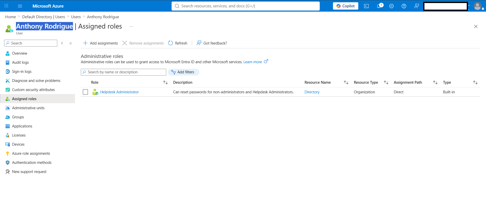
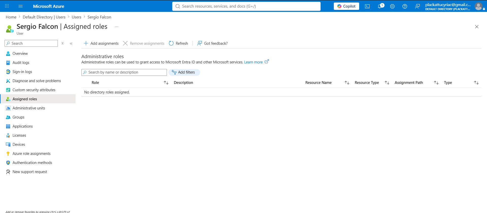
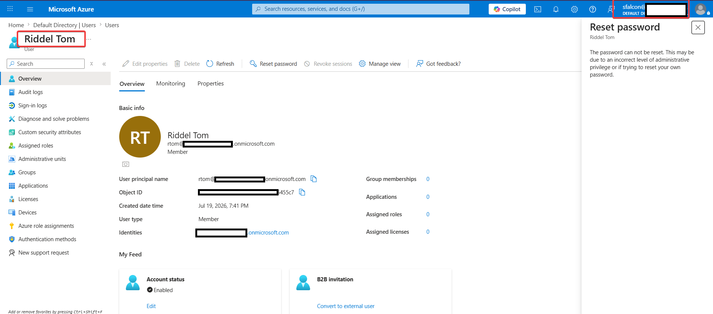
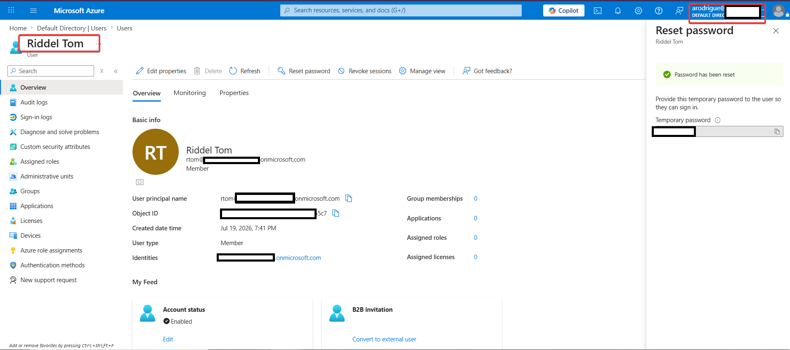

# Microsoft Entra ID: Role-Based Access Control (RBAC) Verification

## Overview
This document details the operational and security differences between two user accounts based on their assigned **Role-Based Access Control (RBAC)** permissions within Microsoft Entra ID (formerly Azure AD).

---

## User Profiles

| User Name | Assigned Role | Access Scope & Capabilities |
| :--- | :--- | :--- |
| **Anthony Rodrigue** | **Helpdesk Administrator** | Authorized to perform administrative tasks, including resetting passwords for non-administrative accounts. |
| **Sergio Falcon** | **Standard User** *(No Roles)* | Unprivileged account restricted to default self-service operations; no administrative privileges. |

---

## Objective
To evaluate, contrast, and document the administrative capabilities and interface permissions between a privileged role holder and an unprivileged standard user within the Entra ID tenant.

---

## Test Case: Password Reset Capabilities

### Scenario
Both accounts attempted to initiate a password reset for a designated target user (a standard, non-administrative account) via the Microsoft Entra ID admin portal.

### Expected vs. Actual Results

* **Anthony Rodrigue (`Helpdesk Administrator`)**
  * **Result:** **`SUCCESS`**
  * **Behavior:** The administrative workflow successfully authorized the request, allowing Anthony to initiate and complete the credential reset for the target user.

* **Sergio Falcon (`Standard User`)**
  * **Result:** **`FAILED / ACCESS DENIED`**
  * **Behavior:** The action was blocked by tenant-level security policy, preventing the execution of the password reset.
  
  > **System Error Message:**  
  > *"The password cannot be reset. This may be due to an incorrect level of administrative privilege or if trying to reset your own password."*

---

## Conclusion
This test confirms the enforcement of **Least Privilege** and RBAC control mechanisms within Microsoft Entra ID:
1. The **Helpdesk Administrator** role correctly delegates the necessary permissions (`microsoft.directory/users/password/update`) to manage user credentials.
2. Accounts lacking explicit administrative roles are strictly blocked from executing administrative operations, preserving the security boundary.
