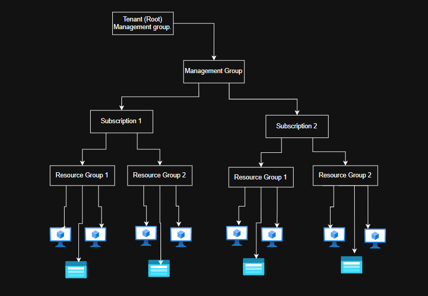

# Microsoft Azure: Management Groups & Role-Based Access Control (RBAC)

## Overview
This document details the setup and configuration of **Azure Management Groups** to streamline subscription governance, alongside the implementation and monitoring of **custom Role-Based Access Control (RBAC)** roles across corporate resource hierarchies.

---

## Azure Governance Hierarchy

Azure resources are structured hierarchically to allow automated governance and inheritance:

> **Conceptual Analogy:** Think of a **Management Group** as a folder and a **Subscription** as a file inside it. 
> - A single Management Group can contain multiple Subscriptions.
> - A Subscription can belong to **only one** Management Group at a time.
> - Any policy, role assignment, or compliance setting applied at the Management Group level is automatically inherited by child Subscriptions, Resource Groups, and Resources.

---

## Objectives
* **Task 1:** Implement and configure Azure Management Groups.
* **Task 2:** Review and assign built-in Azure RBAC roles.
* **Task 3:** Create and deploy a custom RBAC role.
* **Task 4:** Monitor and audit role assignments using the Azure Activity Log.

---

## Lab Implementation Steps

### Task 1: Implement Management Groups
Management groups allow for logical organization of subscriptions to simplify RBAC and Azure Policy inheritance.

1. Sign in to the **Azure Portal**.
2. Search for and select **Subscriptions**.
3. Under the **Organization** section in the left pane, select **Management Groups**.
4. Click **+ Create** and configure the required settings:
   - **Management Group ID:** *(Must be unique across the tenant)*
   - **Management Group Name:** *(Display name for the organization unit)*
5. Click **Submit** to create the group.

> **Note:** Every tenant automatically includes a **Tenant Root Management Group** at the top of the hierarchy, which contains all newly created management groups and subscriptions by default.

---

### Task 2: Review and Assign a Built-in Azure Role
> *This task was completed in the previous lab phase. Please refer to the **`Entra 1.md`** document in this repository for full details on built-in role verification.*

---

### Task 3: Create a Custom RBAC Role
When built-in Azure roles do not meet granular security requirements, custom RBAC roles allow you to define precise permission sets.

1. Navigate to **Management Groups** and select the target group/subscription scope.
2. Select the **Access Control (IAM)** blade from the left menu.
3. Click **+ Add** ➔ **Add custom role**.
4. Step through the wizard tabs:
   - **Basics:** Provide a descriptive custom role name, description, and baseline permissions approach.
   - **Permissions:** Define exact control plane actions allowed (e.g., `Microsoft.Support/*`, `Microsoft.Resources/subscriptions/resourceGroups/read`).
   - **Assignable Scopes:** Specify the Management Group or Subscription level where this custom role can be assigned.
   - **JSON / Review + Create:** Verify the underlying JSON definition and deploy the custom role.

---

### Task 4: Monitor Role Assignments with Activity Log
To maintain administrative oversight and compliance auditing:

1. Navigate to **Subscriptions** (or the specific Resource Group scope).
2. Select **Activity log** from the left pane.
3. Filter by **Operation name**: `Create role assignment` or `Delete role assignment`.
4. Review log details to confirm the event timestamp, caller identity, and assigned role scope.

---

## Key Takeaways
1. **Inheritance Efficiency:** Applying policies or custom RBAC roles at the Management Group scope eliminates the operational overhead of manually assigning roles across individual subscriptions.
2. **Granular Security:** Custom roles ensure compliance with the **Principle of Least Privilege**, granting users only the specific administrative capabilities required for their job function.
