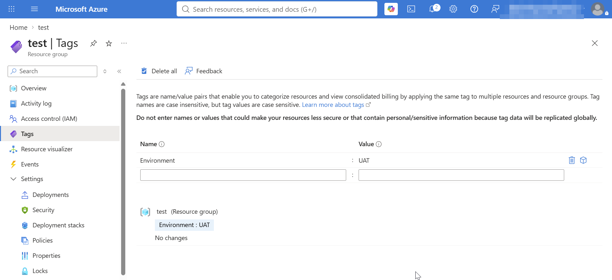
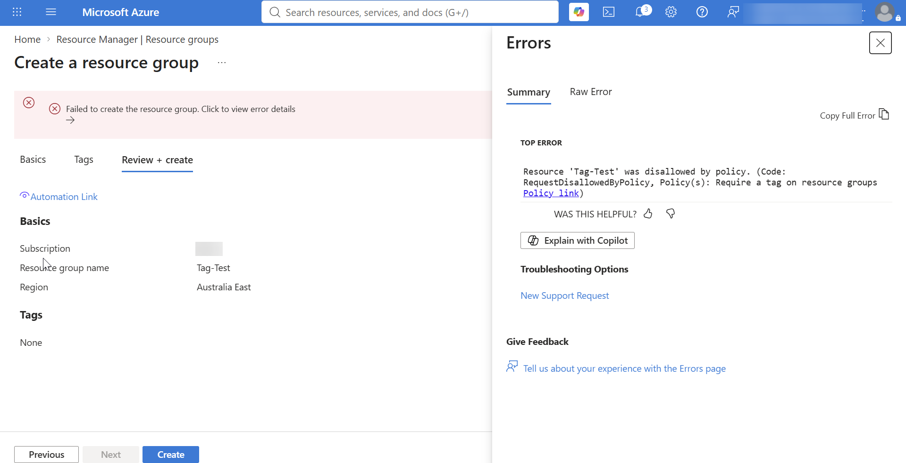

# Microsoft Azure: Resource Governance — Tags, Azure Policy & Resource Locks

## Overview
This document outlines the operational implementation of **Resource Tagging**, automated enforcement and remediation via **Azure Policy**, and protection mechanisms using **Resource Locks** to prevent accidental modifications or deletions.

---

## Understanding Azure Tags

**Azure Tags** are key-value pairs applied to resources, resource groups, and subscriptions. They act like metadata labels to help organize, manage, track, and optimize costs across your cloud environment.

> **Analogy:** Think of tags like sticky notes or organizational labels attached to assets. They allow you to categorize resources by environment (`Env: Prod`), owner (`Owner: Helpdesk`), or cost center (`CostCenter: 104`).

Tags can be assigned manually during resource deployment or configured at any point after creation via the Azure Portal, CLI, or PowerShell.

---

## Objectives
* **Task 1:** Enforce mandatory resource tagging using Azure Policy.
* **Task 2:** Automatically inherit and remediate tags on Resource Groups using Azure Policy.
* **Task 3:** Configure and test Azure Resource Locks (Read-Only vs. Delete).

---

## Lab Implementation Steps

### Task 1: Enforcing Mandatory Tagging via Azure Policy
Enforcing tagging prevents users from deploying any resource unless the required tag is provided during creation.

1. Navigate to the **Azure Portal** and search for **Policy**.
2. Under the **Authoring** section in the left pane, select **Definitions**.
3. Search for the built-in policy definition: **"Require a tag on resources"**.
4. Select the policy and click **Assign policy**.
5. Configure the assignment details:
   - **Scope:** Select your target Subscription or Resource Group.
   - **Parameters:** Specify the required tag name (e.g., `Environment`).
6. Click **Review + Create** ➔ **Create**.

#### Verification & Testing
Attempt to create a new Resource Group without specifying the required tag. The portal validation phase will fail and display a policy violation error message.

---

### Task 2: Automatically Applying & Remediating Tags
Rather than blocking deployment, Azure Policy can automatically apply tags or inherit them across Resource Groups and resources.

1. Navigate to **Policy** ➔ **Definitions**.
2. Search for the built-in policy: **"Add or replace a tag on resource groups"**. *(Note: This specific definition targets resource groups).*
3. Click **Assign policy** and set your target Scope and Parameter values.
4. On the **Remediation** tab, check the box for **Create a Remediation Task**.
5. Select the managed identity type and click **Review + Create**.

#### Handling Existing Resources (Remediation)
For pre-existing Resource Groups that lacked the tag prior to policy assignment:
1. Navigate to **Policy** ➔ **Remediation**.
2. Under **Remediation Tasks**, observe the policy status transition from *Evaluating* to *Complete* as non-compliant resources are automatically updated with the required tag.

> **Note:** A similar built-in policy definition (**"Add or replace a tag on resources"**) can be assigned to automatically apply tags to underlying resources (such as Virtual Machines and Storage Accounts).

---

### Task 3: Protecting Infrastructure with Resource Locks
Resource locks prevent accidental or malicious deletion and modification of critical Azure infrastructure regardless of user permissions.

#### Comparison of Lock Types

| Lock Type | Allows Modification / Creation? | Allows Deletion? | Primary Use Case |
| :--- | :---: | :---: | :--- |
| **`Read-Only` (ReadOnly)** | **No** | **No** | Protects critical production assets from any configuration changes or removal. |
| **`Delete` (CanNotDelete)** | **Yes** | **No** | Allows admins to update/manage resources while preventing accidental deletion. |

---

#### Step-by-Step Lock Configuration & Testing

1. Navigate to the target Resource Group (e.g., `az104-rg2`).
2. Under the **Settings** menu on the left pane, select **Locks**.
3. Click **+ Add** at the top bar.
4. Configure the lock properties:
   - **Lock name:** `rg-deletion-guard`
   - **Lock type:** Select **Delete** (or **Read-Only** depending on test case).
5. Click **OK**.

#### Testing the Delete Lock:
1. Attempt to delete the Resource Group `az104-rg2`.
2. Enter `az104-rg2` in the confirmation box and click **Delete**.
3. Confirm the secondary prompt.
4. **Result:** The system returns a denial notification stating the resource group is locked and cannot be deleted until the lock is explicitly removed.

#### Testing the Read-Only Lock:
1. Apply a **Read-Only** lock to Resource Group `Lab-B`.
2. Attempt to deploy a new resource or modify an existing resource inside `Lab-B`.
3. **Result:** The action is blocked. Under a Read-Only lock, authorized users cannot create, update, or delete resources until the lock is removed.

---

## Key Takeaways
1. **Preventative vs. Corrective Governance:** "Require a tag" policies act as a **preventative guardrail** by blocking invalid deployments, while "Add or replace a tag" policies act as **corrective controls** through automated remediation.
2. **Lock Hierarchy & Override:** Resource locks take precedence over standard RBAC permissions. Even an Azure Subscription Owner cannot delete a locked resource without explicitly removing the lock first.
